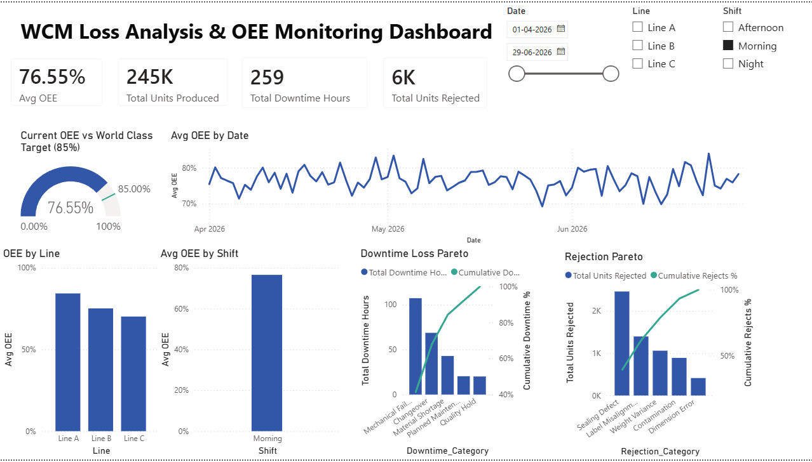
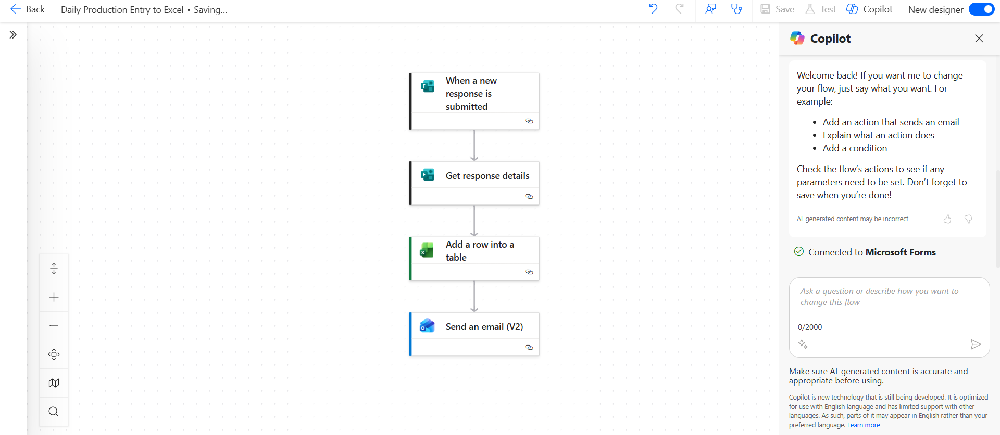
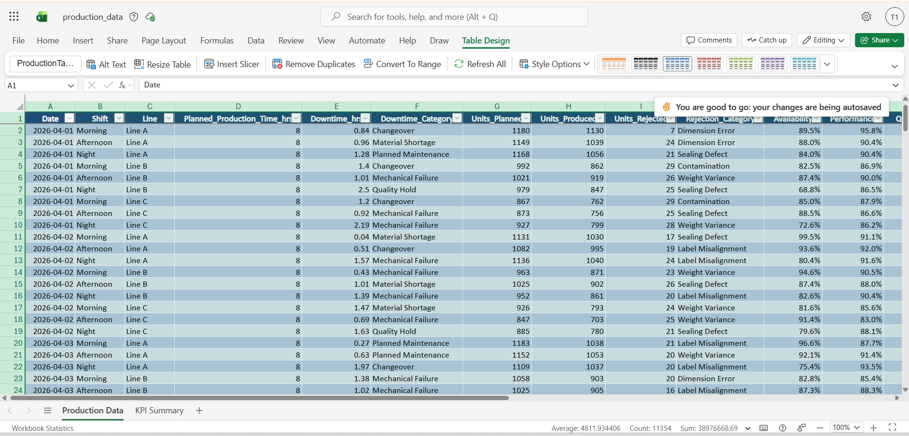

# WCM Loss Analysis & OEE Monitoring Dashboard

An end-to-end **World Class Manufacturing (WCM)** analytics project that turns
raw production line data into actionable loss analysis. It models a dairy and
beverage carton packaging operation across three lines and three shifts, computes
**Overall Equipment Effectiveness (OEE)**, and surfaces the biggest losses
through **Pareto analysis** so improvement effort is directed where it pays off.

The project demonstrates a complete continuous improvement data pipeline: data
capture (Microsoft Forms) → automation (Power Automate) → storage (Excel /
OneDrive) → analysis and visualization (Power BI) → KPI tracking and reporting.

---

## What this project shows

- **OEE framework** broken into its three components: Availability, Performance,
  Quality, and the composite OEE, benchmarked against the 85% world class target.
- **Loss analysis** with Pareto charts that isolate the dominant downtime and
  rejection drivers (the classic 80/20 focus of WCM).
- **KPI tracking** by line, by shift, and month over month.
- **A real automation loop** so shop-floor data entry feeds dashboards with zero
  manual rekeying.

### Headline insights from the generated dataset

- Overall OEE averages **~74%**, against the **85%** world class target — a clear
  improvement gap.
- **Line A** is the strongest performer; **Line C** and the **Night shift** carry
  the most loss.
- **Mechanical Failure** is the single largest downtime category (~42% of all
  downtime hours), making it the priority for a focused improvement project.

---

## Technologies used

| Layer | Tool |
|-------|------|
| Data generation / processing | **Python** (pandas, numpy, openpyxl) |
| Data capture | **Microsoft Forms** |
| Automation | **Power Automate** |
| Storage | **Excel** / OneDrive |
| Visualization & KPI tracking | **Microsoft Power BI** |

---

## What the dashboard shows

- **OEE gauge** — current average OEE vs the 85% world class target.
- **OEE trend** — OEE over time to track improvement.
- **OEE by Line and by Shift** — side-by-side comparison to locate weak points.
- **Downtime Pareto** — losses by category, sorted largest to smallest with a
  cumulative % line.
- **Rejection Pareto** — quality losses by defect category.
- **KPI cards** — Average OEE, Total Units Produced, Total Downtime Hours, Total
  Units Rejected.
- **Slicers** — filter the whole report by Date range, Line, and Shift.

---

## Screenshots

### Power BI OEE Dashboard
The full dashboard: OEE gauge vs the 85% world class target, OEE trend, OEE by
Line and Shift, downtime and rejection Pareto charts, KPI cards, and slicers.



### Automated data capture (Power Automate)
A Power Automate cloud flow that fires when a Microsoft Forms response is
submitted, writes the record into the Excel file in OneDrive, and emails a shift
summary to the supervisor.



### Production dataset (Excel table in OneDrive)
The production data stored as an Excel table, ready for both Power BI analysis and
automated row inserts from the flow.



---

## Repository structure

```
project/
├── README.md                  # This file
├── generate_data.py           # Generates the production dataset + KPI summary
├── requirements.txt           # Python dependencies
├── .gitignore
├── data/
│   └── production_data.xlsx    # Raw data + KPI Summary sheet
├── screenshots/               # Dashboard, flow, and dataset screenshots
└── forms_template.md          # Microsoft Forms field specification
```

---

## How to run

```bash
# 1. Install dependencies
pip install -r requirements.txt

# 2. Generate the dataset (creates data/production_data.xlsx)
python generate_data.py
```

The script writes a 90-day, shift-level dataset (810 records) with computed OEE
components, plus a formatted **KPI Summary** sheet in the same workbook. The
dashboard is built in Power BI Desktop on top of this dataset.

---

## The dataset

`data/production_data.xlsx` → sheet **Production Data**:

| Column | Description |
|--------|-------------|
| Date | Production date (daily, last 90 days) |
| Shift | Morning / Afternoon / Night |
| Line | Line A / Line B / Line C |
| Planned_Production_Time_hrs | Scheduled run time per shift (8h) |
| Downtime_hrs | Total stop time |
| Downtime_Category | Mechanical Failure / Changeover / Material Shortage / Planned Maintenance / Quality Hold |
| Units_Planned | Target units for the shift |
| Units_Produced | Actual units produced |
| Units_Rejected | Units failing QC |
| Rejection_Category | Sealing Defect / Label Misalignment / Weight Variance / Contamination / Dimension Error |
| Availability | (Planned Time − Downtime) / Planned Time |
| Performance | Units Produced / Units Planned |
| Quality | (Produced − Rejected) / Produced |
| OEE | Availability × Performance × Quality |

Sheet **KPI Summary** aggregates overall OEE, OEE by line and shift, top downtime
and rejection categories, and the month-over-month OEE trend.

---

## Methodology notes

OEE is decomposed the standard WCM way so each loss bucket is attributable:

- **Availability** captures downtime losses (breakdowns, changeovers, material).
- **Performance** captures speed losses against plan.
- **Quality** captures rejection losses.

Keeping the three factors independent avoids double-counting and lets the Pareto
charts point directly at the highest-value improvement opportunity — here,
Mechanical Failure downtime, the natural target for a focused kaizen.

---

_Built as a portfolio project demonstrating WCM, OEE, loss analysis, Pareto
analysis, and continuous improvement using Python, Power BI, Power Automate,
Microsoft Forms, and Excel._
